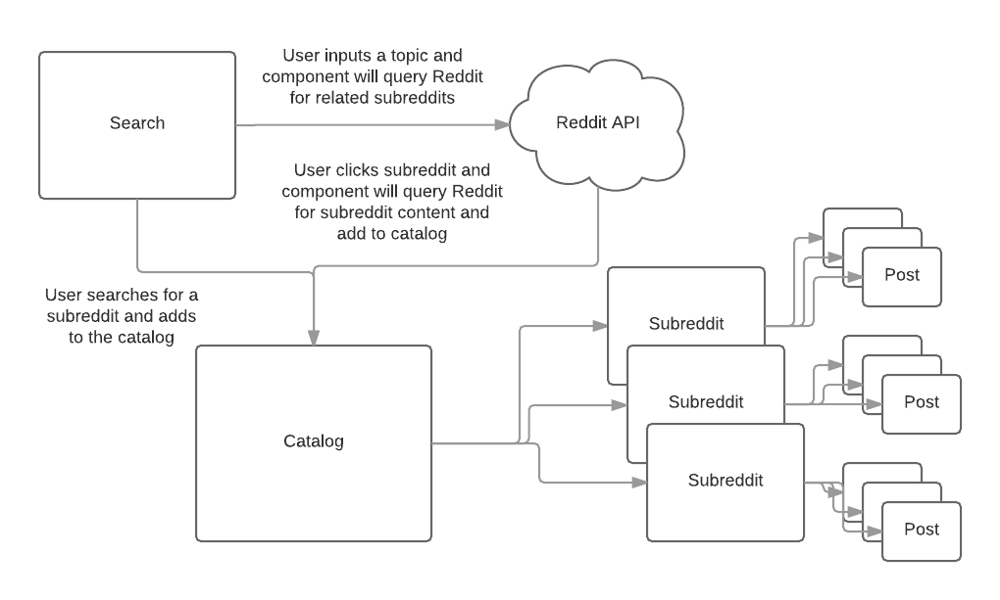

# reddit-reader
Access multiple subreddits in one place. 

## System design
Here's a basic diagram that I made to give me structure in the process of building this app:

## Getting started
### How to install dependencies
In your root directory, run `npm install`.

### How to run app
* In your root directory, run `npm run server-dev`.
* Then in new tab, run `npm run react-dev`.
* Go to `localhost:5000` in your browser to use app.

## Using app
* Search for subreddits by inputting topics in the textbox.
* Upon form submission, a list of relative subreddits will render below form.
* Click on subreddit name in list to add to end of catalog.
* Click on title in a post to visit url.
* Click on comments in a post to visit post's comments page on Reddit.
* Delete subreddit in catalog by clicking delete button at bottom of subreddit.

## Notes
Built with React and Webpack.
